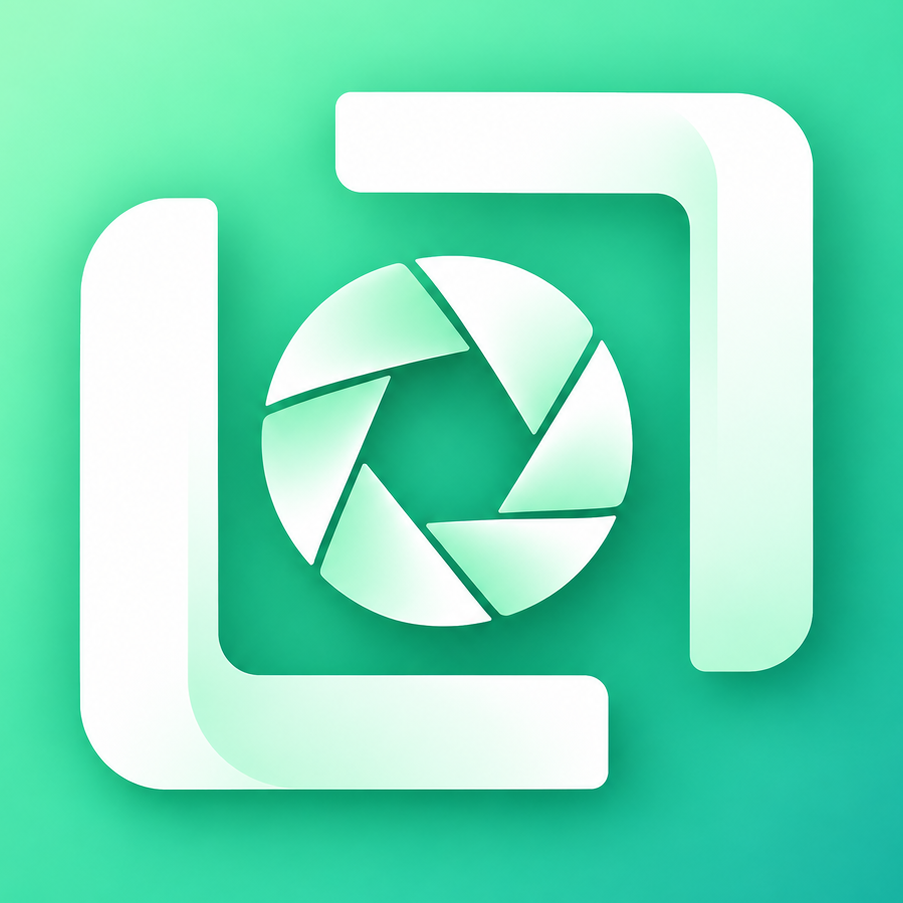

<p align="center">
  
</p>

<h1 align="center">OpenLens</h1>

<p align="center">
  <a href="LICENSE">
    
  </a>
  
</p>

<p align="center">
  
  
  
</p>

<p align="center">
  <strong>Browser-based photo editing tools that run locally in your browser, with no uploads and no server-side processing.</strong>
</p>

---

## Overview

OpenLens is a privacy-first image editor rebuilt in Svelte. It lets you make fast, on-device edits such as cropping, resizing, rotating, applying creative effects, and removing backgrounds without sending your images anywhere.

The app is designed to be lightweight, static, and hostable anywhere, while still supporting a rich editor experience in the browser.

## Features

- Crop and resize with interactive controls
- Rotate by 90° or adjust with a custom angle
- Convert between PNG, JPEG, and WebP
- Compress JPEG and WebP output with quality controls
- Remove backgrounds locally using browser-side AI
- Add text effects, overlays, and layered compositions
- Apply artistic filters and creative transformations
- Keep all processing on-device for privacy and speed

## Tech stack

- Svelte 5
- Vite
- JavaScript modules and component-based UI
- Browser-only image processing
- Local background removal via `@imgly/background-removal`

## Local development

### Prerequisites

- Node.js 18+ recommended
- npm

### Install dependencies

```bash
npm install
```

### Start the dev server

```bash
npm run dev
```

Then open the local Vite URL shown in the terminal, usually:

- http://localhost:5173

### Production build

```bash
npm run build
```

This builds the app and runs the landing-page prerender step.

### Preview the production build

```bash
npm run preview
```

## Available scripts

```bash
npm run dev        # start the Vite development server
npm run build      # production build + prerender landing page
npm run build:app  # build app assets only
npm run preview    # preview the production build
npm run check      # run Svelte checks
npm test           # run JavaScript unit tests
npm run test:e2e   # run end-to-end checks
npm run test:landing # run landing-page checks
```

## Project structure

```text
.
├─ index.html                 # landing entry page
├─ public/                   # static assets, manifest, landing media
├─ src/
│  ├─ App.svelte             # main app shell
│  ├─ main.js                # app bootstrap
│  ├─ landing/               # landing page Svelte components and styles
│  ├─ lib/                  # editor logic and state modules
│  └─ styles/               # shared styling tokens and base CSS
├─ tests/                    # unit and integration tests
├─ prerender-landing.mjs     # build-time landing page prerender script
├─ svelte.config.js          # Svelte config
├─ vite.config.js            # Vite config
├─ package.json              # scripts and dependencies
├─ jsconfig.json             # JS project config
├─ LICENSE                   # AGPL v3 license
└─ README.md
```

## Deployment notes

OpenLens is a static client-side app and works well with any static host, including GitHub Pages and simple HTTP servers.

For local testing, you can also serve the built output with a static server, but the normal development workflow is to use Vite.

## Privacy and data handling

- Images stay on the user's device
- No uploads are required for editing
- Background removal and processing run in the browser
- No server-side image storage or processing is required for core workflows

## License

This project is licensed under the AGPL v3. See the [LICENSE](LICENSE) file for details.
